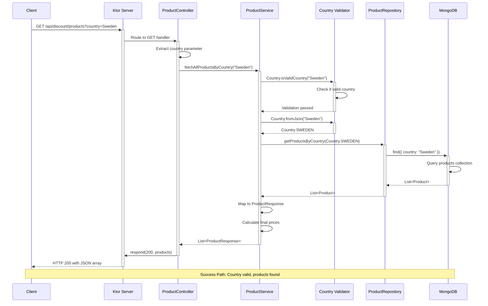
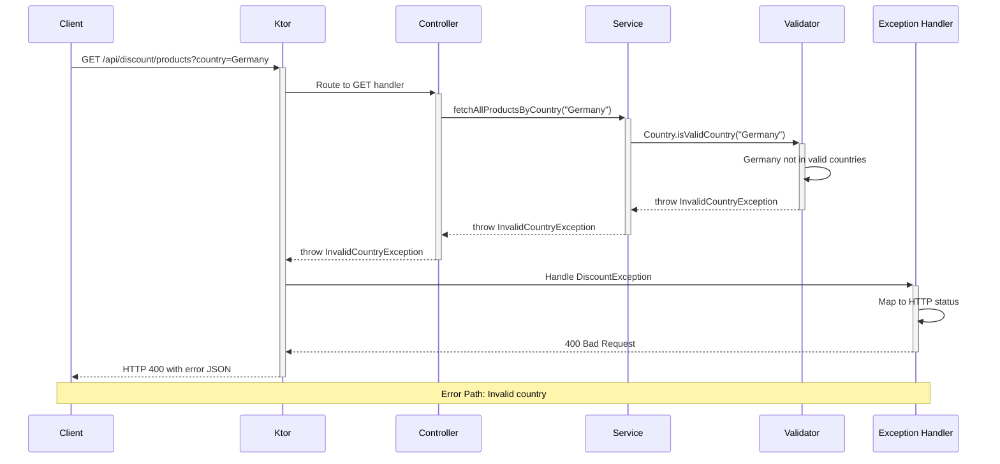
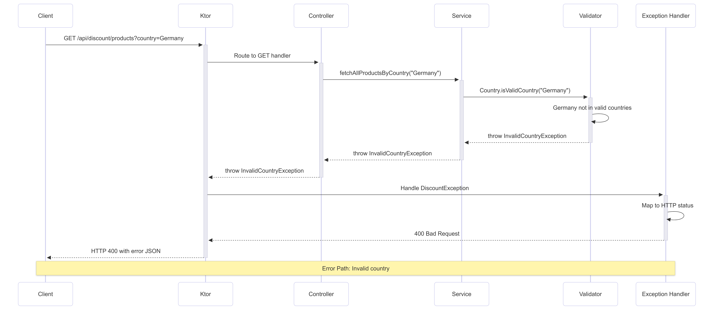
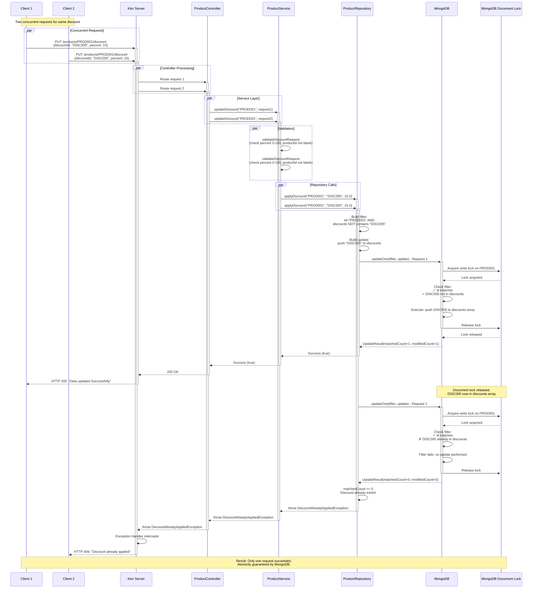
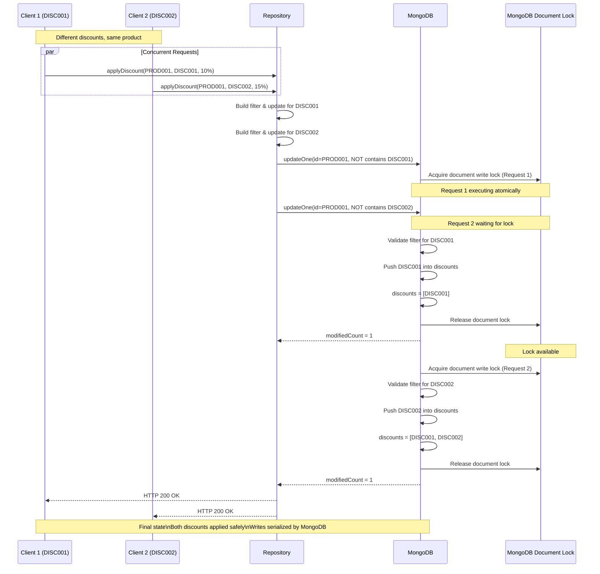

# Architecture Documentation

## Overview

The Discount API is a Kotlin-based microservice built with the Ktor framework and MongoDB. It manages product discounts for multiple countries (Sweden, French, Italian) with a focus on handling concurrent discount applications safely and efficiently.

## Design Philosophy

### Layered Architecture

The application follows a clean, layered architecture pattern:

```
Controller Layer (HTTP) → Service Layer (Business Logic) → Repository Layer (Data Access) → Database
```

**Key Design Principles:**
1. **Separation of Concerns**: Each layer has a distinct responsibility
2. **Dependency Injection**: Using Kodein DI for loose coupling
3. **Coroutine-First**: Leveraging Kotlin coroutines for non-blocking I/O
4. **Exception Handling**: Centralized exception handling with custom exception hierarchy
5. **Immutability**: Data classes are immutable by default

### Technology Stack Rationale

#### Why MongoDB Over PostgreSQL?

**MongoDB was chosen for several compelling reasons:**

1. **Document-Oriented Model**
   - Products with variable discount arrays fit naturally into document structure
   - No need for complex JOIN operations or separate discount tables
   - Schema flexibility allows easy addition of new product attributes

2. **Atomic Array Operations**
   - MongoDB's `$push` with conditions provides atomic array updates
   - Native support for querying and updating embedded documents
   - No need for separate transaction management for array modifications

3. **Horizontal Scalability**
   - MongoDB sharding provides better horizontal scaling for high-traffic scenarios
   - Replica sets offer built-in high availability
   - Better suited for eventual consistency models in distributed systems

4. **Performance Characteristics**
   - Faster write operations for document updates
   - Efficient indexing on embedded document fields
   - Better performance for read-heavy workloads with denormalized data

**PostgreSQL Trade-offs:**
- Would require separate `products` and `discounts` tables with foreign key relationships
- More complex transactions needed for ensuring consistency
- ACID guarantees are overkill for this use case (eventual consistency is acceptable)
- Higher latency for join operations when fetching products with discounts
- More rigid schema makes rapid iteration harder

## Concurrency Strategy

### The Concurrency Challenge

When multiple requests try to apply the same discount to the same product simultaneously, we need to ensure:
1. **Idempotency**: The same discount is applied only once
2. **Consistency**: No race conditions allow duplicate discounts
3. **Performance**: Minimal blocking and high throughput

### How MongoDB Handles Concurrency Internally

MongoDB provides **document-level locking** with ACID guarantees at the single-document level:

#### MongoDB's Internal Locking Mechanism

1. **WiredTiger Storage Engine**
   - Uses Multi-Version Concurrency Control (MVCC)
   - Optimistic concurrency control at the document level
   - Intent locks at database/collection level, exclusive locks at document level during writes

2. **Atomic Operations**
   - The `updateOne()` operation is **atomic at the document level**
   - The filter and update are executed as a single atomic operation
   - No other thread can modify the document between the filter check and update

3. **Our Implementation**
```kotlin
val filter = and(
    Product::id eq productId,
    not(Product::discounts.elemMatch(Discount::discountId eq discountId))
)
val update = push(Product::discounts, Discount(discountId, percent))
val result = productsCollection.updateOne(filter, update)
```

**How This Guarantees Concurrency Safety:**

- **Thread 1** attempts to apply discount "DISC001" to product "PROD001"
- **Thread 2** simultaneously attempts to apply the same discount
- MongoDB acquires a write lock on the document
- **Thread 1** executes first: filter matches (discount not present), update succeeds
- **Thread 2** executes after lock is released: filter fails (discount now present), update returns matchedCount=0
- Result: Only Thread 1 succeeds, Thread 2 gets `DiscountAlreadyAppliedException`

#### Why This Approach is Superior

**MongoDB's atomic operation ensures:**
- No time gap between "check" and "set" operations (no TOCTOU vulnerability)
- Database-level consistency without application-level coordination
- Works correctly even with multiple application instances behind a load balancer


### Proof from Mongo Official Documentation
#### Atomicity and Transactions

In MongoDB, a write operation is [atomic](https://mongodbcom-cdn.staging.corp.mongodb.com/docs/reference/glossary/#std-term-atomic-operation) on the level of a single document, even if the operation modifies multiple values. When multiple update commands happen in parallel, each individual command ensures that the query condition still matches.

To guarantee that concurrent update commands do not conflict with each other, you can specify the expected current value of a field in the update filter.

#### Example

Consider a collection with this document:

```javascript
db.games.insertOne( { _id: 1, score: 80 } )
```

These update operations occur concurrently:

```javascript
// Update A
db.games.updateOne(
   { score: 80 },
   {
      $set: { score: 90 }
   }
)

// Update B
db.games.updateOne(
   { score: 80 },
   {
      $set: { score: 100 }
   }
)
```

One update operation sets the document's `score` field to either `90` or `100`. After this update completes, the second update operation no longer matches the query predicate `{ score: 80 }`, and is not performed.


### Why Application-Level Locks Don't Work

**Application-level locks (mutex, synchronized blocks) are ineffective for distributed systems:**

```kotlin
// ❌ THIS DOESN'T WORK IN DISTRIBUTED SYSTEMS
private val lock = Mutex()

suspend fun applyDiscount(productId: String, discountId: String) {
    lock.withLock {
        // Check if discount exists
        val product = findProduct(productId)
        if (product.hasDiscount(discountId)) {
            throw DiscountAlreadyAppliedException()
        }
        // Apply discount
        updateProduct(product)
    }
}
```

**Problems with Application-Level Locks:**

1. **Not Distributed**: Lock only works within a single JVM instance
   - Load balancer routes Request 1 to Instance A, Request 2 to Instance B
   - Each instance has its own lock—no coordination between them
   - Both instances can apply the same discount simultaneously

2. **Race Condition Still Exists**: Even in single instance
   ```
   Time 1: Thread 1 reads product (no discount exists)
   Time 2: Thread 2 reads product (no discount exists)
   Time 3: Thread 1 updates product (adds discount)
   Time 4: Thread 2 updates product (adds discount again) ❌
   ```
   The gap between read and write creates a race condition at the database level

3. **Blocking Performance**: Application-level locks create contention
   - All requests for the same product are serialized
   - Reduces throughput significantly under high load
   - Doesn't scale horizontally

4. **Deadlock Risk**: Complex lock hierarchies can lead to deadlocks

### Why Manual DB Locks Are Not Required

Some might consider manual database locking approaches:

#### Pessimistic Locking with SELECT FOR UPDATE (PostgreSQL-style)
```sql
-- ❌ Overly Complex
BEGIN TRANSACTION;
SELECT * FROM products WHERE id = 'PROD001' FOR UPDATE;
-- Check if discount exists in application code
-- Insert discount if not exists
COMMIT;
```

**Why This is Unnecessary:**

1. **Performance Overhead**
   - Explicit transactions add latency
   - Locks held for longer duration (network round-trips)
   - Reduces concurrent throughput

2. **Complexity**
   - Requires transaction management in application code
   - Deadlock detection and retry logic needed
   - Error handling becomes more complex

3. **MongoDB Doesn't Support It Anyway**
   - MongoDB doesn't have SELECT FOR UPDATE semantics
   - MongoDB's atomic operations achieve the same goal more efficiently

#### Optimistic Locking with Version Fields
```kotlin
// ❌ Unnecessary Complexity
data class Product(
    val id: String,
    val version: Int,
    val discounts: List<Discount>
)

// Check version, update only if unchanged
updateOne(
    and(Product::id eq productId, Product::version eq expectedVersion),
    set(Product::discounts, newDiscounts),
    inc(Product::version, 1)
)
```

**Why This is Overkill:**

1. **Built-in Alternative**: MongoDB's conditional `updateOne` already provides optimistic concurrency
2. **Extra Field**: Version field is redundant for our use case
3. **Retry Logic**: Requires application-level retry on version conflicts
4. **Not Solving Our Problem**: We need to check if discount exists, not if document changed

#### Document Locking with `lockUntil` Pattern
```kotlin
// ❌ Over-engineered
data class Product(
    val id: String,
    val lockUntil: Instant?,
    val lockedBy: String?,
    val discounts: List<Discount>
)

// Acquire lock
updateOne(
    and(Product::id eq productId, Product::lockUntil lt now()),
    set(Product::lockUntil, now() + 5.seconds, Product::lockedBy, instanceId)
)
// ... perform operation ...
// Release lock
```

**Why This is Inefficient:**

1. **Two-Phase Operations**: Requires separate lock acquisition, operation, and lock release
2. **Lock Timeout Management**: Need background jobs to clean up stale locks
3. **Reduced Concurrency**: Entire document locked, even for independent discount operations
4. **Failure Scenarios**: Crashes can leave locks dangling
5. **Performance**: Multiple round-trips to database

### Our Elegant Solution: Atomic Conditional Updates

**Our implementation leverages MongoDB's atomic operations:**

```kotlin
override suspend fun applyDiscount(
    productId: String,
    discountId: String,
    percent: Double
): Boolean {
    val filter = and(
        Product::id eq productId,
        not(Product::discounts.elemMatch(Discount::discountId eq discountId))
    )
    val update = push(Product::discounts, Discount(discountId, percent))
    val result = productsCollection.updateOne(filter, update)

    if (result.matchedCount == 0L) {
        throw DiscountAlreadyAppliedException("Discount already applied or product not found")
    }
    return result.modifiedCount > 0
}
```

**Why This Works Perfectly:**

1. **Atomic**: Filter + update execute atomically at database level
2. **Idempotent**: Same discount cannot be added twice
3. **Concurrent**: Multiple different discounts can be added simultaneously
4. **No Locks**: No explicit locking needed
5. **Distributed**: Works across multiple application instances
6. **Efficient**: Single database operation, no retries needed

**Concurrency Behavior:**
```
Time 0: Product has discounts: [DISC001, DISC002]

Concurrent Requests:
- Thread 1: Apply DISC003 → Filter matches → Update succeeds → [DISC001, DISC002, DISC003]
- Thread 2: Apply DISC003 → Filter fails (DISC003 now exists) → Exception thrown
- Thread 3: Apply DISC004 → Filter matches → Update succeeds → [DISC001, DISC002, DISC003, DISC004]

Result: Each unique discount applied once, operations don't block each other
```

## MongoDB Instance Creation in Multi-Threaded Environment

### Thread-Safe Singleton Pattern

Our `MongoConfigurationFactory` ensures thread-safe MongoDB client creation:

```kotlin
object MongoConfigurationFactory {
    private val databases = ConcurrentHashMap<String, CoroutineDatabase>()

    fun getDatabase(databaseName: String, databaseUrl: String? = null): CoroutineDatabase {
        // Fast path: database already exists (no lock)
        databases[databaseName]?.let { return it }

        // Slow path: create database (synchronized)
        synchronized(databases) {
            // Double-check: another thread might have created it
            databases[databaseName]?.let { return it }

            logger.info("Creating MongoDatabase instance for $databaseName...")
            
            val dbClient: CoroutineClient = createClient(databaseUrl)
            val database = dbClient.getDatabase(databaseName)
            databases[databaseName] = database
            return database
        }
    }
}
```

**Double-Checked Locking Pattern:**

1. **First Check (Unlocked)**: Fast path for subsequent calls
   - Most requests hit this path (database already created)
   - No synchronization overhead
   - High concurrency for reads

2. **Synchronized Block**: Only for first creation
   - Multiple threads might pass first check simultaneously
   - `synchronized` ensures only one enters critical section

3. **Second Check (Locked)**: Prevent duplicate creation
   - Winner thread creates the database
   - Loser threads see existing database and return it

4. **ConcurrentHashMap**: Thread-safe storage
   - Provides thread-safe `put` and `get` operations
   - No need for additional synchronization for lookups

**Why This Matters:**

- **Connection Pooling**: MongoDB client maintains an internal connection pool
- **Thread-Safe Client**: MongoClient is thread-safe and designed for reuse
- **Resource Efficiency**: Single client per database, shared across all coroutines
- **Configuration**: Connection pool settings control concurrency:
  ```kotlin
  ConnectionPoolSettings.builder()
      .maxConnectionIdleTime(60000, TimeUnit.MILLISECONDS)
      .minSize(5)
      .maxSize(20)
      .build()
  ```

**Connection Pool Behavior:**
- Minimum 5 connections always maintained
- Maximum 20 connections under load
- Idle connections recycled after 60 seconds
- Each coroutine borrows a connection from the pool
- Non-blocking operations return connections immediately

## API Endpoints

### GET /api/discount/products

Retrieve products filtered by country with calculated final prices.

**Request:**
```http
GET /api/discount/products?country=Sweden
```

**Response:**
```json
[
  {
    "id": "PROD001",
    "name": "Product Name",
    "basePrice": 100.0,
    "country": "Sweden",
    "finalPrice": 85.0,
    "discounts": [
      {
        "discountId": "DISC001",
        "percent": 15.0
      }
    ]
  }
]
```

#### Sequence Diagram: GET /products




**Error Scenario:**




### PUT /api/discount/products/{id}/discount

Apply a discount to a product with atomic concurrency control.

**Request:**
```http
PUT /api/discount/products/PROD001/discount
Content-Type: application/json

{
  "discountId": "DISC005",
  "percent": 15.0
}
```

**Response:**
```json
{
  "status": 200,
  "message": "Data updated Successfully"
}
```

#### Sequence Diagram: PUT /products/{id}/discount




**Key Concurrency Points:**

1. **No Application Lock**: Both requests proceed to MongoDB
2. **MongoDB Serializes**: Document-level lock ensures atomic execution
3. **Filter Evaluation**: Happens inside the atomic operation
4. **Idempotency**: Second request fails gracefully with specific error
5. **No Retry Needed**: Application doesn't need retry logic

#### Concurrent Different Discounts




## Exception Hierarchy

Custom exception hierarchy for precise error handling:

```
DiscountException (Base)
├── InvalidCountryException (400)
├── InvalidProductIdException (400)
├── InvalidDiscountException (400)
├── ProductNotFoundException (404)
├── DiscountAlreadyAppliedException (409)
└── DatabaseOperationException (500)
```

Each exception maps to appropriate HTTP status codes via centralized exception handler.

## Performance Characteristics

### Concurrency Performance

**Single Product, Multiple Discount Operations:**
- ✅ **Parallel Execution**: Different discounts applied concurrently
- ✅ **No Blocking**: No application-level locks
- ✅ **Minimal Contention**: Document-level locks held briefly

**Load Test Results** (20 concurrent requests to apply same discount):
```
🚀 Sending 20 concurrent requests
✅ [0] Status: 200  ← First request succeeds
❌ [1-19] Status: 409 ← Others fail with DiscountAlreadyAppliedException
⏱ Completed in ~150ms
```

### Scalability

**Horizontal Scaling:**
- Multiple application instances can run concurrently
- Load balancer distributes requests across instances
- MongoDB handles concurrency at database level
- No shared state between application instances

**Connection Pooling:**
- Min 5, Max 20 connections per instance
- Connection reuse reduces overhead
- Idle timeout prevents resource waste

## Testing Strategy

1. **Unit Tests**: Service logic with mocked repository
2. **Integration Tests**: Full stack with test MongoDB instance
3. **Concurrency Tests**: Concurrent discount application validation
4. **Controller Tests**: HTTP endpoint behavior verification

## Future Enhancements

1. **Caching Layer**: Redis for frequently accessed products
2. **Event Sourcing**: Audit log for discount changes
3. **Metrics**: Prometheus metrics for monitoring
4. **Rate Limiting**: Per-client rate limiting
5. **Bulk Operations**: Apply discounts to multiple products atomically

## Conclusion

This architecture demonstrates that **simple atomic database operations can solve complex concurrency problems** more elegantly than application-level locking, distributed locks, or complex transaction management. By leveraging MongoDB's native capabilities, we achieve:

- **Correctness**: Guaranteed idempotency and consistency
- **Performance**: High throughput with minimal blocking
- **Simplicity**: Clean, maintainable code without lock management
- **Scalability**: Works across distributed application instances

The key insight: **Push complexity to the layer that can handle it best**—in this case, the database.
